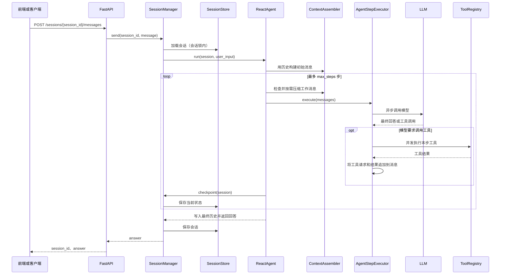

# Taiyi Agent

Taiyi Agent 是一个基于 Python 的对话 Agent 项目，通过兼容 OpenAI 的模型接口完成多轮对话、工具调用和上下文压缩。当前部署使用 ReAct Agent，提供命令行入口、FastAPI 服务和无需构建的静态前端。

已实现的主要能力：

- 创建多个独立 session，分别保存系统提示词和对话历史。
- 使用同一个 session_id 连续对话；同一 session 内的请求串行执行，不同 session 可以并发处理。
- 在一轮用户请求内循环执行模型调用、工具执行和结果回传，直到得到最终回答或达到步骤限制。
- 支持原生工具调用和通过提示词约定 JSON 的工具调用策略。
- 支持异步工具，以及通过线程池兼容同步工具。
- 构建和压缩上下文，控制历史消息及工具轨迹的 token 占用。
- 通过前端创建、切换、重命名、删除会话和查看历史。

本文以当前仓库实现为准。memory 已有独立存储接口和内存实现，但尚未自动接入部署对话流程；RAG 目前保留目录，尚无检索流水线。

## 1. 环境准备

需要 Python 3.11 或更高版本。以下命令以 Windows PowerShell 为例，均从项目根目录执行：

```powershell
Set-Location 'E:\code\agent_project\hello_agent\chapter07\taiyi-agent'
```

### 1.1 安装依赖

新环境可创建并使用项目虚拟环境；已有可用环境时可直接使用它：

```powershell
python -m venv .venv
.\.venv\Scripts\Activate.ps1
python -m pip install --upgrade pip
python -m pip install -e .
python -m pip install tavily-python httpx tzdata
```

`pip install -e .` 安装 pyproject.toml 中的依赖，并使 src 下的 taiyi_agent 包可被导入。当前部署入口直接导入并实例化 Tavily 工具，tavily-python 尚未列入项目依赖，因此需要补充安装。HTTP 工具使用 httpx；Windows 环境安装 tzdata 可为 ZoneInfo 提供时区数据。

如果 PowerShell 无法激活虚拟环境，可以直接使用其解释器，无需调整系统策略：

```powershell
.\.venv\Scripts\python.exe -m pip install -e .
.\.venv\Scripts\python.exe -m pip install tavily-python httpx tzdata
```

后续启动命令中的 python 也可替换为这个解释器路径。

### 1.2 配置环境变量

在项目根目录自行创建 .env，填写实际的模型配置和工具密钥：

```dotenv
# 必填：兼容 OpenAI Chat Completions 的模型服务
LLM_API_KEY=replace_with_your_llm_api_key
LLM_BASE_URL=https://your-llm-provider.example/v1
LLM_MODEL_ID=replace_with_your_model_id
LLM_TIMEOUT=60

# 当前部署入口启动时会实例化 Tavily 客户端，需要配置
TAVILY_API_KEY=replace_with_your_tavily_api_key

# 调用对应工具时需要配置
SERPAPI_API_KEY=replace_with_your_serpapi_api_key
QWEATHER_API_KEY=replace_with_your_qweather_api_key

# 可选：tokenizer 的模型 ID 或本地目录
QWEN_TOKENIZER_MODEL=Qwen/Qwen3-Embedding-0.6B
```

LLM_MODEL_ID 应填写服务商实际支持的模型名称。默认部署采用 NativeToolCallingStrategy，所选模型及服务接口需要支持 tools/tool_calls；代码也提供 PromptToolCallingStrategy，可供不支持原生工具调用的模型集成使用，当前 API 尚未提供策略切换参数。

TokenCounter 初始化时尝试通过 ModelScope 或 Transformers 加载 tokenizer，首次启动可能需要下载文件。可将 QWEN_TOKENIZER_MODEL 指向本地 tokenizer 目录；加载失败时，当前实现退回 UTF-8 字节估算，统计结果不等同于模型的精确计费 token。

天气工具目前使用 weather_tool.py 内的 QWEATHER_HOST 常量，不读取同名环境变量。调用前需要确认该地址与自己的和风天气账号/API Host 匹配；配置 API key 本身不会改变地址。

当前普通会话不需要 Embedding 配置。仅当额外 ContextItem 需要计算相关性时，ContextBuilder 会读取另一组变量：

```dotenv
OPENAI_API_KEY=replace_with_your_embedding_api_key
OPENAI_BASE_URL=https://your-embedding-provider.example/v1
OPENAI_EMBEDDING_MODEL=replace_with_your_embedding_model_id
```

这些变量与 LLM_API_KEY、LLM_BASE_URL 分别读取，不会自动互相替代。

## 2. 启动方案

### 2.1 启动 FastAPI 后端

完成环境配置后，从项目根目录执行：

```powershell
python -m uvicorn taiyi_agent.deploy.react_deploy_fastapi:app --app-dir src --host 127.0.0.1 --port 8000 --workers 1
```

也可以运行模块，由其内置入口启动服务；该入口默认监听 0.0.0.0:8000：

```powershell
python -m taiyi_agent.deploy.react_deploy_fastapi
```

启动后访问：

- 健康检查：http://127.0.0.1:8000/health
- Swagger 接口文档：http://127.0.0.1:8000/docs
- OpenAPI 描述：http://127.0.0.1:8000/openapi.json

服务在 FastAPI lifespan 中初始化模型客户端、工具注册表、上下文组件和 SessionManager。当前使用进程内存保存 session 及标题，应使用单 worker；多个 worker 各自持有独立数据，无法共享同一会话。服务重启或开发模式的热重载会清空这些数据。

### 2.2 启动网页前端

保持后端运行，在另一个终端进入项目根目录，启动静态文件服务：

```powershell
python -m http.server 5173 --bind 127.0.0.1 --directory frontend
```

浏览器打开 http://127.0.0.1:5173/index.html。前端默认连接 http://127.0.0.1:8000，不需要 Node.js、npm 或构建步骤。后端已配置 CORS，允许静态前端调用接口。

页面支持创建和切换多个会话、连续发送消息、查看历史、重命名及删除会话。Enter 发送，Shift+Enter 换行。后端每次返回完整 answer，当前前端和会话 API 尚未提供流式输出。

如需连接其他 API 地址，可在页面加载 app.js 前设置 window.APP_CONFIG.API_BASE，具体方式见 frontend/README.md。

### 2.3 启动命令行对话

```powershell
python -m taiyi_agent.deploy.react_deploy_local
```

命令行入口创建一个 session，每次输入都调用 SessionManager.send() 并复用该 session 的历史，输入 q 退出。它与 FastAPI 使用相同类型的模型、工具和上下文组件，但运行在自己的进程中，不会读取网页服务的会话。

examples/hello_agent_demo.py 是引用 hello_agents 包的教学示例，不是当前 taiyi_agent 的部署入口。

## 3. 会话 API 与连续对话

### 3.1 接口清单

| 方法 | 路径 | 功能 |
| --- | --- | --- |
| GET | /health | 检查服务是否可响应 |
| POST | /sessions | 创建会话，返回独立 UUID |
| GET | /sessions | 列出本 API 创建且仍存在的会话，按更新时间倒序排列 |
| GET | /sessions/{session_id} | 获取会话配置、标题、revision 和历史 |
| PATCH | /sessions/{session_id} | 使用 title 字段重命名会话 |
| POST | /sessions/{session_id}/messages | 使用 message 字段发送一轮用户请求 |
| DELETE | /sessions/{session_id} | 删除会话及历史，返回 204 |

创建请求可以不带 body，也可以传入：

```json
{
  "system_prompt": "你是一个中文助手，请结合历史消息回答。",
  "agent_type": "react",
  "max_steps": 6
}
```

当前 AgentFactory 只注册了 react。max_steps 范围为 1～100，表示一次用户请求允许执行的 ReAct 步骤数，不是会话最多允许的轮数。

发送消息的请求和响应：

```json
{
  "message": "我叫小明，请记住。",
  "max_steps": 6
}
```

```json
{
  "session_id": "会话的 UUID",
  "answer": "模型返回的完整回答"
}
```

消息请求里的 max_steps 可省略，省略时使用 session 的值；传入时仅覆盖本次执行。后续对话必须继续使用创建时返回的 session_id，重新创建 session 会开启一份空历史。

### 3.2 PowerShell 调用示例

后端运行后，可在新终端中执行：

```powershell
$apiBase = 'http://127.0.0.1:8000'

# 创建两个独立会话
$sessionA = Invoke-RestMethod -Method Post -Uri "$apiBase/sessions" -ContentType 'application/json' -Body '{}'
$sessionB = Invoke-RestMethod -Method Post -Uri "$apiBase/sessions" -ContentType 'application/json' -Body '{}'

# 在 A 中进行第一轮对话
$body1 = @{ message = '我叫小明，请记住。' } | ConvertTo-Json
Invoke-RestMethod -Method Post -Uri "$apiBase/sessions/$($sessionA.session_id)/messages" -ContentType 'application/json; charset=utf-8' -Body ([System.Text.Encoding]::UTF8.GetBytes($body1))

# 继续使用 A 的 session_id，第二轮会包含前一轮的历史
$body2 = @{ message = '我叫什么名字？' } | ConvertTo-Json
Invoke-RestMethod -Method Post -Uri "$apiBase/sessions/$($sessionA.session_id)/messages" -ContentType 'application/json; charset=utf-8' -Body ([System.Text.Encoding]::UTF8.GetBytes($body2))

# 查看 A 的历史；B 此时仍是独立的空会话
Invoke-RestMethod -Uri "$apiBase/sessions/$($sessionA.session_id)"
Invoke-RestMethod -Uri "$apiBase/sessions/$($sessionB.session_id)"
```

不存在的会话返回 404；非法 UUID 或请求字段不符合约束时返回 422；消息处理中的 Agent 异常被接口包装为 502。达到 ReAct 步数限制时，当前实现会以 answer 字段返回限制提示。

## 4. 目录结构

```text
taiyi-agent/
├── readme.md
├── pyproject.toml                 项目与依赖配置
├── uv.lock                        uv 依赖锁文件
├── frontend/                      静态网页及其使用说明
├── examples/                      教学示例
├── test/                          本地测试及真实接口演示脚本
└── src/taiyi_agent/
    ├── core/                      模型接口、消息、配置、基础异常
    ├── agents/                    SimpleAgent、ReAct 循环及 Agent 工厂
    ├── sessions/                  会话状态、生命周期及存储协议
    ├── context/                   上下文构建、压缩和 token 预算
    ├── tool/                      工具定义、注册、调用策略及具体工具
    │   ├── function_tool/         普通函数与异步函数包装
    │   ├── datetime_tool/         时间与时区工具
    │   └── search_tool/           Tavily、SerpAPI、天气查询
    ├── history/                   简单对话历史容器
    ├── memory/                    记忆结构与存储实现
    │   └── rag/                   RAG 预留目录
    └── deploy/                    命令行与 FastAPI 部署入口
```

## 5. 各模块的功能

### 5.1 core：模型接口与基础结构

| 文件 | 职责 |
| --- | --- |
| llm.py | TaiyiAgentLLM 封装 OpenAI 兼容客户端，提供 invoke、stream、ainvoke、astream，解析模型回答和工具调用参数 |
| message.py | Message 表示 user、assistant、system、tool 等消息，支持转换为模型请求格式 |
| tool_call.py | ToolCall、LLMResponse、ToolExecution 统一工具请求、模型响应和执行结果结构 |
| config.py | Config 提供通用配置和 ContextConfig；部分配置支持从环境变量读取 |
| agent.py | BaseAgent 是 SimpleAgent 使用的基础接口；当前 ReactAgent 使用独立的 session 执行接口 |
| exceptions.py | TaiyiAgentException、LLMException 表示框架和模型调用异常 |

当前部署直接初始化 TaiyiAgentLLM 和 ContextConfig，并未自动将 Config 的所有字段应用到服务。

### 5.2 agents：对话与 ReAct 执行

| 文件 | 职责 |
| --- | --- |
| simple_agent.py | 保存自身 History 的基础对话 Agent，支持同步、异步和同步流式回答；不承担当前部署的工具循环 |
| react_agent.py | 一个 run 对应一个用户 turn；管理开始、模型/工具循环、步骤上限、结束和失败处理 |
| agent_step.py | AgentStepExecutor 执行一次模型调用和本次返回的工具调用，将工具结果追加到工作消息；多个工具通过 asyncio.gather 并发执行 |
| agent_factory.py | 根据 session.agent_type 创建 Agent，注入模型、上下文和工具依赖；当前注册 react |

### 5.3 sessions：多会话隔离与连续对话

| 文件 | 职责 |
| --- | --- |
| session.py | SessionState 保存会话配置、history、active_turn 和 revision；TurnState 保存当前用户输入、工作消息及步骤记录 |
| session_manager.py | 加载/创建会话、调用 AgentFactory、执行一轮请求并保存检查点；使用会话级锁避免同一个 session 同时执行两个 turn |
| session_store.py | SessionStore 定义异步 get/save/delete 协议；InMemorySessionStore 在进程内按 UUID 保存状态，读写使用深拷贝 |

Session 是完整的一段对话；Turn 是一次用户请求及其最终回答；Step 是该请求内的一次模型调用和可能的工具执行。

一轮正常完成后，默认只把用户输入和最终回答追加到 session.history，并清除 active_turn。下一轮会从这份历史构建上下文。中间轨迹保存在运行中的 TurnState，当前没有独立的永久审计存储；persist_trace 默认关闭。SessionStore 与 memory 模块中的 MemoryStore 是两种不同用途的存储。

### 5.4 context：上下文构建与 token 控制

| 文件 | 职责 |
| --- | --- |
| context_data.py | ContextConfig、ContextItem、ContextSection、BuiltContext 定义预算、候选信息、结构化区块及构建结果 |
| context_builder.py | 按 Gather → Select → Structure → Compress 流程组织系统指令、历史和额外信息；提供旧历史摘要和工具轨迹摘要 |
| context_assembler.py | 为 turn 构建初始模型消息；在每次模型调用前检查 token，保留指令和当前输入，对历史、已有摘要及工具轨迹进行压缩 |
| token_counter.py | 统计消息及正文 token，按预算截断文本；当前优先加载 tokenizer，失败时采用估算 |
| token_window.py | 提供可用输入预算及 clip/fit 裁剪方法；当前 ReAct 每步主要通过 ContextAssembler 执行摘要压缩 |

当前 ContextConfig 默认值：

| 配置 | 默认值 | 含义 |
| --- | --- | --- |
| max_tokens | 16384 | 配置的上下文总预算 |
| reserved_output_tokens | 2048 | 为输出预留的预算 |
| compression_trigger_ratio | 0.8 | 每步消息超过可用输入预算的 80% 时触发压缩 |
| compression_target_ratio | 0.6 | 每步消息压缩到可用输入预算的 60% 以内 |
| max_history_messages | 50 | 构建上下文时最多选取最近的历史消息数 |
| history_keep_recent | 6 | 历史区块压缩时优先保留的最近消息数 |
| history_summary_max_tokens | 1024 | ContextBuilder 中旧历史摘要的长度上限，仍受剩余预算约束 |

可用输入预算为 max_tokens - reserved_output_tokens，即默认 14336。实际触发和目标比例以配置字段为准；context_assembler.py 中关于 70%/50% 的说明文字尚未同步到当前默认值。

history_summary_max_tokens 约束初始历史区块的旧消息摘要；每步工具轨迹摘要则使用压缩目标扣除固定消息及消息开销后的预算。历史筛选和上下文压缩改变的是发送给模型的上下文，不会直接清空 session.history。

reserved_output_tokens 用于计算输入预算，当前 LLM 请求并未据此显式设置生成 token 上限。如果系统指令和当前输入本身超过压缩目标，当前 ContextAssembler 会抛出异常；这与超过模型实际窗口不是同一条件。

### 5.5 tool：异步工具系统

| 文件/目录 | 职责 |
| --- | --- |
| tool_base.py | ToolParameter 描述参数；BaseTool 定义工具接口及 schema，arun 兼容同步 run，纯异步工具可直接覆盖 arun |
| function_tool/function_tool.py | FunctionTool 包装注册函数，识别普通异步函数并 await；同步函数在线程池中执行 |
| tool_registry.py | 注册工具对象或函数，生成工具描述及 OpenAI schema；aexecute_tool 提供统一异步执行入口、超时和错误反馈 |
| tool_calling.py | NativeToolCallingStrategy 使用模型原生 tools；PromptToolCallingStrategy 使用提示词和 JSON 约定；两者都负责追加工具结果 |
| datetime_tool/get_current_time_tool.py | GetCurrentTimeTool 查询指定时区时间，通过同步 run 与基类异步适配执行 |
| search_tool/tavily_search.py | TavilySearchTool 使用 AsyncTavilyClient 搜索并整理结果 |
| search_tool/web_search_tool.py | SerpSearchTool 使用 httpx 异步请求 SerpAPI，提取答案和搜索摘要 |
| search_tool/weather_tool.py | WeatherTool 查询城市 ID，再查询实时天气或预报；当前对外参数使用 now、3d、7d |

命令行与 FastAPI 入口当前都注册时间、Tavily、SerpAPI 和天气四个工具。工具选择由模型响应驱动；Tavily 优先、SerpAPI 兜底是工具描述中的建议，并非代码强制执行的回退链。

工具注册、JSON 解析和消息拼装保持同步即可；涉及网络等待的执行方法使用 async/await。外部调用统一使用 await registry.aexecute_tool(...)。同步工具在线程池中的执行不会因等待超时而保证立即停止。

### 5.6 history：简单历史容器

history.py 中的 History 提供 add_history、get_history、clear_history，主要供 SimpleAgent 使用。get_history 返回深拷贝。ReAct 的对话历史直接保存在 SessionState.history 中，不通过这个容器管理。

### 5.7 memory 与 RAG：独立记忆能力及预留接口

| 文件/目录 | 职责及当前状态 |
| --- | --- |
| memory_record.py | MemoryRecord 保存 user_id、内容、标签、重要性和时间等字段 |
| memory_store.py | MemoryStore 定义异步新增、读取、检索、更新、删除和清空接口 |
| in_memory_store.py | InMemoryStore 按用户筛选记忆，结合关键词匹配、重要性和更新时间排序；属于内存实现，不是向量数据库 |
| rag/ | 预留目录，当前没有文档导入、分块、向量索引和检索实现 |

ContextBuilder 接收 additional_items，预留 memory/rag 类型的上下文信息，但自动读取 MemoryStore 和 RAG 的逻辑目前没有接通。网页里的“记住上一轮”来自 session.history，不能理解为已自动写入持久化用户记忆。

### 5.8 deploy 与 frontend：应用入口

react_deploy_local.py 负责终端输入循环；react_deploy_fastapi.py 负责应用初始化、会话 CRUD、消息接口和 CORS。会话标题索引目前保存在 app.state.session_titles 中。

frontend/index.html、styles.css、app.js 分别负责页面结构、样式和 API 交互。前端通过 session_id 切换历史，同一会话的多次发送对应后端的多个 turn。

## 6. 一次请求如何执行



模型不再要求调用工具时退出循环；后续用户消息通过新的 HTTP 请求启动下一个 turn。服务端没有等待用户输入的无限对话循环。

## 7. 测试与扩展

test 目录同时包含使用 mock 模型的回归测试，以及直接调用真实模型/工具的演示脚本。开发测试时可补充安装 pytest 和 pytest-asyncio：

```powershell
python -m pip install pytest pytest-asyncio
python -m pytest test/test_agent_project.py -q
```

test_agent_project.py 使用 mock 模型检查消息结构、Agent 行为、会话、上下文、工具和记忆等模块。其余文件需根据实际接口和配置选择执行；部分文件在导入时就运行真实接口调用，不宜把全量 test 目录视为纯离线测试。测试代码也需要随接口和默认参数变更保持同步。

后续扩展可以围绕现有模块边界进行：

- 持久化会话：实现 SessionStore.get/save/delete，并同步设计会话列表、标题索引和跨进程并发控制。
- 新增工具：实现 BaseTool 的 get_parameters 及 run/arun，或通过 register_function 包装函数，再在部署入口注册。
- 新增 Agent：实现 session 执行接口，在 AgentFactory 中注册 builder。
- 接入记忆：明确 user_id 与 session_id 的关系，连接 MemoryStore 的写入、召回与 ContextBuilder。
- 接入 RAG：实现文档处理、索引及检索，将检索结果组织为 ContextItem。
- 流式对话：在部署层增加流式响应协议，并与 ReAct 工具步骤、会话保存和前端消费配合。

当前部署尚无用户身份与会话归属校验；session_id 提供的是会话状态隔离。面向多用户部署时，需要在 API 层补充身份与权限处理。
